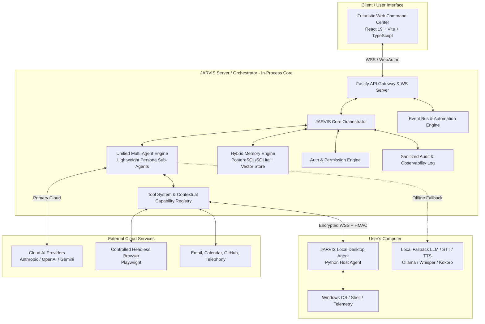

# JARVIS — Principal System Architecture

## 1. Architectural Vision & Scope

JARVIS is designed as a secure, modular, highly extensible personal AI operating system and proactive digital assistant. The system provides a futuristic web command center while safely executing authorized tasks on the user's desktop, managing web interactions, orchestrating specialized AI agent personas, retaining long-term memory, running automated background workflows, and delivering multi-channel notifications.

This document defines the high-level architecture across all system boundaries, incorporating **Offline/Degraded Operations**, **Unified In-Process Agent Runtimes**, and **Sanitized Telemetry Streaming**.

---

## 2. System Boundaries & Topology

---

## 3. Core Component Roles

| Layer / Component | Technology Stack | Core Responsibilities | Communication Protocols |
|---|---|---|---|
| **Web Command Center** | React 19, TypeScript, Vite, Tailwind CSS, Framer Motion, Socket.io-client | Primary UI, HUD, voice audio streamer, sanitized activity feed, telemetry, settings | WSS (WebSockets), HTTPS, WebAuthn |
| **Backend Orchestrator** | Node.js (TypeScript), Fastify, Socket.io, Prisma, Zod | Intent routing, context assembly, HITL approval enforcement, event dispatching, fallback management | REST, WSS, Internal Bus |
| **Unified Multi-Agent Engine** | TypeScript (In-Process LangGraph / DAG Router) | Specialized agent personas (Coding, Research, Desktop, etc.) running in a single node process | In-memory function calls, Event Bus |
| **Tool Execution Layer** | Node.js / TypeScript | Contextual permission checking, parameter scoping, lifecycle hooks, execution wrapping | In-memory, Local IPC, RPC |
| **Local Desktop Agent** | Python 3.11+ / PyWin32 / PyAutoGUI | Windows OS interactions, app management, process telemetry, terminal runner | Encrypted WSS (Local loopback / mTLS) |
| **Offline Local AI Stack** | Ollama / Llama.cpp / Faster-Whisper | Offline LLM inference and local speech processing during cloud network disconnects | Local REST / HTTP API |
| **Browser Agent Engine** | Playwright / Chromium | Isolated web browsing, extraction, form filling, web research | Playwright CDP / WebSocket |
| **Memory System** | PostgreSQL (PGVector) / SQLite / Redis | Short-term context, episodic memory, vector similarity search, user preference store | SQL, Vector Index Queries |

---

## 4. Offline & Degraded Mode Strategy

JARVIS is designed to remain operational even when external cloud services or Internet connectivity become unavailable:

1. **Automatic Connectivity Sensing**:
   - The Server Orchestrator continuously monitors Internet connectivity and Cloud LLM API health.
   - If Cloud APIs fail or latency exceeds thresholds, the system seamlessly transitions to **Degraded Offline Mode**.
2. **Offline Capabilities**:
   - Switches cognitive reasoning to local Ollama models (e.g. `llama3.2` / `qwen2.5-coder`).
   - Switches speech processing to local `faster-whisper` and `kokoro-tts`.
   - Maintains 100% desktop agent control, file operations, process monitoring, and local documentation search.
3. **Gracefully Disabled Capabilities**:
   - Web browsing, external search, email sending, and remote API webhooks are paused.
   - Outbound automation events are queued locally and executed upon reconnect.

---

## 5. Non-Negotiable Architectural Principles

1. **Least Privilege & Contextual Scoping**: Permissions are evaluated dynamically against target paths, parameters, and action risk.
2. **Human-in-the-Loop (HITL) Enforcement**: Consequential operations (terminal commands, app launching, file deletion, email sending) require explicit user approval.
3. **Untrusted Data Isolation**: All content retrieved from external sources (web pages, emails, documents) is tagged as untrusted text and stripped of executable instruction context.
4. **Sanitized Observability & Raw CoT Isolation**: Internal raw model chain-of-thought (CoT) scratchpads are stripped of raw prompts and confidential system logic before sending high-level progress indicators to the user interface.
