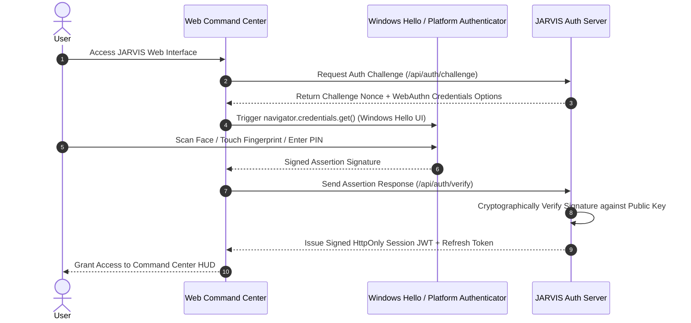

# JARVIS — Authentication & Biometric Identity Architecture

## 1. Authentication Architecture Overview

JARVIS implements a secure authentication flow leveraging modern web standards. To provide a futuristic experience without compromising privacy or security, authentication relies on **WebAuthn (FIDO2 / Passkeys)** backed by platform authenticators such as **Windows Hello (Face / Fingerprint / PIN)**.

---

## 2. Authentication Protocol Sequence

---

## 3. WebAuthn & Windows Hello Integration Standard

1. **Biometric Data Boundary**:
   - **Zero Raw Biometric Storage**: JARVIS NEVER receives, transmits, or stores raw facial scans, fingerprint images, or biometric templates.
   - All biometric matching takes place strictly inside the isolated security hardware (TPM / Windows Hello sandbox).
   - JARVIS receives only a cryptographically signed FIDO2 assertion confirming successful local biometric authentication.
2. **Device Registration & Trust Pairing**:
   - During initial setup, the user registers their primary computer via WebAuthn (`navigator.credentials.create()`).
   - The generated public key is stored in the database, bound to the user profile.

---

## 4. Session & Re-Authentication Policy

1. **Session Hierarchy**:
   - **Short-Lived Access Token**: JWT signed with HS256/RS256, 15-minute expiration, stored in-memory in web client.
   - **Refresh Token**: Cryptographic random token, 7-day expiration, stored in `HttpOnly`, `SameSite=Strict`, `Secure` cookie.
2. **Re-Authentication for Sensitive Actions**:
   - Performing high-risk or critical operations (e.g. updating master API keys, modifying local command whitelist, triggering remote shell) requires **Step-Up Authentication**.
   - The user must re-verify via Windows Hello / WebAuthn prompt before the sensitive tool call is executed.
3. **Session Revocation**:
   - Users can view all active logged-in sessions in the Settings HUD and revoke any session remotely.
