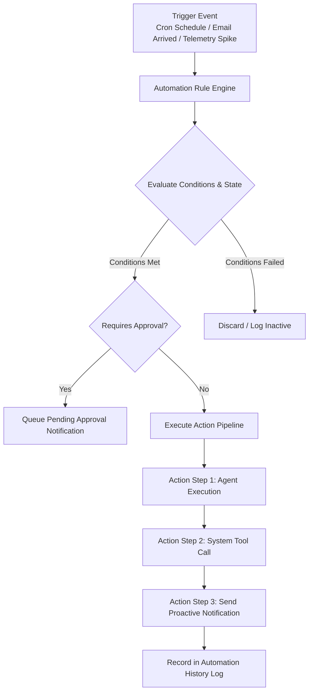

# JARVIS — Event-Driven Automation Engine

## 1. Automation Engine Overview

The **Automation Engine** (`apps/server/automation`) enables JARVIS to execute automated routines, background jobs, scheduled tasks, and event-reactive workflows without constant manual prompting.

---

## 2. Rule Architecture & Execution Pipeline



---

## 3. Workflow Rule Schema Standard

Automation routines are defined declaratively in JSON/YAML:

```typescript
export interface AutomationRule {
  id: string;
  name: string;
  description: string;
  enabled: boolean;
  trigger: {
    type: 'cron' | 'event' | 'webhook' | 'system';
    expression?: string; // e.g. "0 8 * * 1-5" (Every weekday at 8 AM)
    eventType?: string;  // e.g. "email.received"
    filterCondition?: string; // JSONPath or JS expression
  };
  conditions: Array<{
    field: string;
    operator: 'equals' | 'contains' | 'greater_than' | 'less_than';
    value: unknown;
  }>;
  actions: Array<{
    actionType: 'agent_invoke' | 'tool_call' | 'notification_send' | 'script_exec';
    target: string;
    params: Record<string, unknown>;
  }>;
  errorPolicy: {
    maxRetries: number;
    retryDelayMs: number;
    onFailure: 'notify_user' | 'silent_ignore' | 'disable_rule';
  };
}
```

---

## 4. Typical Automation Flow Examples

### 4.1 Daily Morning Briefing Workflow
- **Trigger**: Cron `0 8 * * 1-5` (8:00 AM weekdays).
- **Actions**:
  1. Fetch calendar events for the day via `calendar_get_events`.
  2. Fetch unread high-priority emails via `email_fetch_inbox`.
  3. Fetch pending task list from database.
  4. Pass raw context to Orchestrator to generate concise summary.
  5. Send proactive HUD notification and speak brief voice summary if user is active.

### 4.2 High CPU Alert Automation
- **Trigger**: Event `telemetry.hardware` where `cpu_usage > 90%` for > 3 minutes.
- **Actions**:
  1. Fetch top 5 resource-consuming local processes via `psutil`.
  2. Format process list and dispatch `HIGH` priority alert to UI HUD.
  3. Provide quick action buttons in UI: *"Kill process PID 8812 (chrome.exe)"*.

---

## 5. Execution Guarantees & Safety Controls

1. **Idempotency Safeguards**: Event-based rules track processed event UUIDs to prevent double-execution when duplicate events arrive.
2. **Infinite Loop Prevention**: An automation rule cannot trigger itself directly or indirectly; maximum recursive workflow depth is hard-capped at 2.
3. **Graceful Retry & Circuit Breaking**: Failed actions retry up to 3 times with exponential backoff before disabling the rule and notifying the user.
