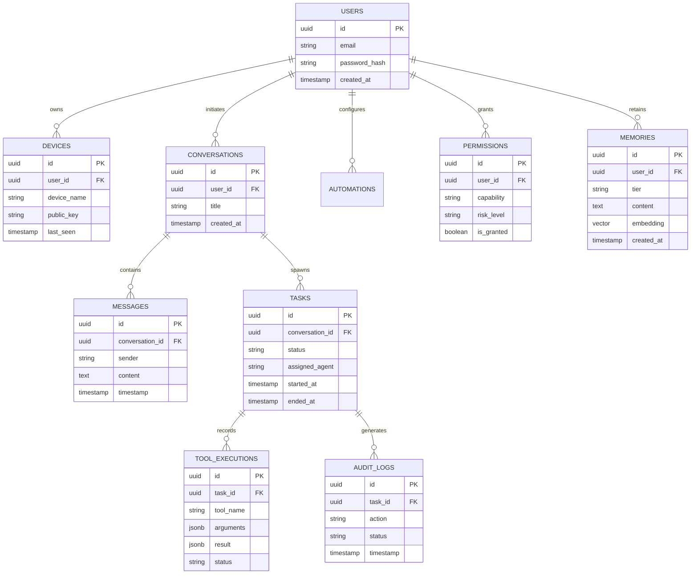

# JARVIS — Database & Persistence Model

## 1. Database Architecture Strategy

JARVIS utilizes a **Hybrid Storage Strategy** designed for simplicity, performance, and strong data integrity:

1. **Primary Relational Store**: **PostgreSQL** (production) / **SQLite** via **Prisma ORM** (development/local). Manages users, devices, permissions, conversations, task states, automation rules, and audit logs.
2. **Vector Index Store**: **PGVector** extension (or Qdrant / LanceDB) for project embeddings, document RAG, and memory similarity search.
3. **Session & In-Memory Cache**: **Redis** (or in-memory cache) for WebSocket state, active task locks, rate limiting, and short-term message buffers.

---

## 2. Entity Relationship Diagram (ERD)

---

## 3. Core Database Tables & Schemas

### 3.1 `users` Table
- `id` (UUID, Primary Key)
- `email` (String, Unique)
- `password_hash` (String, Encrypted)
- `created_at` (Timestamp)

### 3.2 `devices` Table (Paired Local Agents & Browsers)
- `id` (UUID, Primary Key)
- `user_id` (UUID, Foreign Key -> `users.id`)
- `device_name` (String, e.g. "Workstation-Win11")
- `public_key` (Text, WebAuthn / HMAC Key)
- `is_trusted` (Boolean, Default: false)
- `last_seen` (Timestamp)

### 3.3 `tool_executions` Table
- `id` (UUID, Primary Key)
- `task_id` (UUID, Foreign Key -> `tasks.id`)
- `tool_name` (String)
- `arguments` (JSONB)
- `result` (JSONB)
- `execution_time_ms` (Integer)
- `status` (Enum: 'SUCCESS', 'FAILED', 'CANCELLED', 'DENIED')

### 3.4 `memories` Table
- `id` (UUID, Primary Key)
- `user_id` (UUID, Foreign Key -> `users.id`)
- `tier` (Enum: 'SHORT_TERM', 'LONG_TERM', 'PROJECT', 'EPISODIC', 'PREFERENCE')
- `content` (Text)
- `metadata` (JSONB)
- `embedding` (Vector(1536) / PGVector)
- `created_at` (Timestamp)
