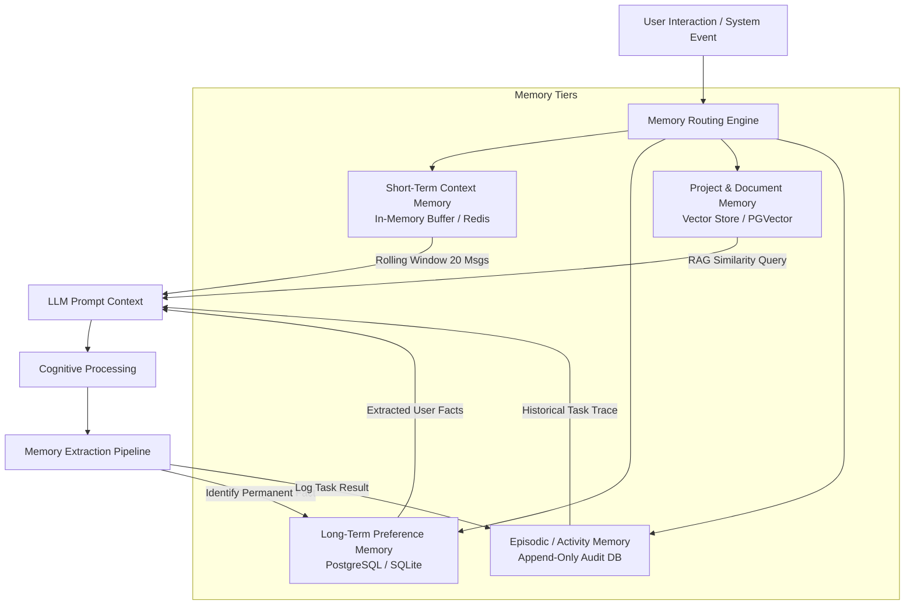

# JARVIS — Hybrid Memory Subsystem Architecture

## 1. Memory Subsystem Overview

JARVIS implements a multi-tier **Hybrid Memory System** combining relational state persistence, key-value session caching, and vector embedding similarity search. This ensures JARVIS retains immediate conversation context, long-term user facts, project knowledge, past activity logs, and explicit preferences while safeguarding user privacy and data retention limits.

---

## 2. Multi-Tier Memory Topology



---

## 3. Specification of Memory Tiers

| Memory Tier | Storage Engine | Scope & Duration | Purpose | Decay / Retention Policy |
|---|---|---|---|---|
| **Short-Term Memory (STM)** | Redis / In-Memory RAM | Active Session / Current Task | Maintains rolling transcript of ongoing conversation and tool calls. | Purged after task completion or 24 hours of inactivity. |
| **Long-Term Memory (LTM)** | Relational DB (PostgreSQL/SQLite) | User Lifetime | Stores explicit facts, relationships, user identity details (e.g. preferred editor, coding style, timezone). | Retained permanently until deleted by user via UI settings. |
| **Project Memory** | Vector Database (PGVector / Qdrant) | Project Workspace | RAG vector embeddings of project documentation, codebase structures, and local markdown files. | Invalidate embeddings when target files change on disk. |
| **Episodic Memory** | Append-Only DB (PostgreSQL / SQLite) | Audit / Historical Trace | Log of past actions taken by JARVIS ("Completed build at 14:20", "Summarized 5 emails"). | Configurable retention (e.g. 30 days default; rotatable). |
| **Preference Memory** | Relational DB (Structured KV) | User Preferences | Key-value settings governing behavior (e.g. verbosity, voice model, notification channel priorities). | Persisted; manageable in Settings UI. |

---

## 4. Vector Embedding & Retrieval-Augmented Generation (RAG)

1. **Embedding Generation**:
   - Chunking Strategy: Recursive character text splitting (500 tokens per chunk with 50-token overlap).
   - Embedding Model: Provider-agnostic interface (`text-embedding-3-small`, `bge-small-en-v1.5`, or local Ollama embeddings).
2. **Retrieval Pipeline**:
   - Query Vectorization -> Top-K cosine similarity search ($k=5$).
   - Re-ranking filter: Deduplicates chunks and filters results with distance metric $>0.75$.
   - Citation Provenance: Retrieved chunks append source metadata (`source_file`, `page_number`, `last_modified`).

---

## 5. Memory Extraction & Provenance Tracking

1. **Automatic Fact Extraction**:
   - After a conversation turn, a background micro-prompt evaluates if the user stated a persistent preference (e.g., *"I prefer TypeScript over JavaScript"*).
   - If detected, an entry is created in `ltm_facts` with provenance fields:
     ```json
     {
       "factId": "fact_9921a",
       "category": "user_preference",
       "fact": "User prefers TypeScript over JavaScript for web projects",
       "sourceConversationId": "conv_4412",
       "confidenceScore": 0.95,
       "createdAt": "2026-09-22T15:35:00Z"
     }
     ```
2. **User Memory Control Dashboard**:
   - The Web UI provides a dedicated **Memory Explorer** tab.
   - Users can search, edit, inspect provenance, and permanently delete any long-term fact or project embedding stored by JARVIS.
