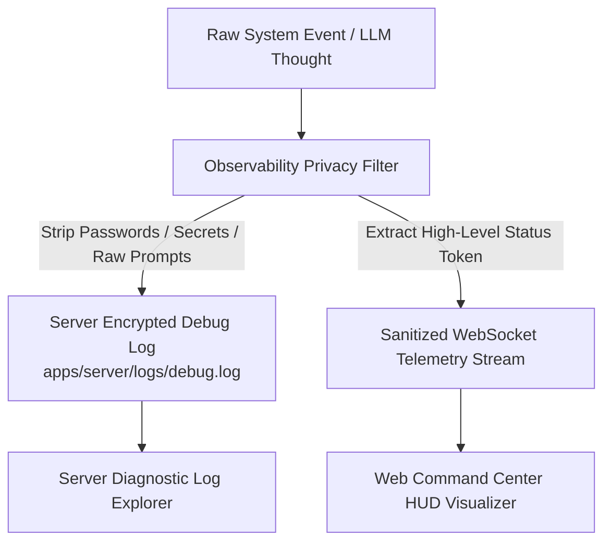

# JARVIS — Observability & Privacy-Preserving Logging Framework

## 1. Observability Architecture Overview

JARVIS implements an **Observability & Privacy-Preserving Telemetry Framework**. The system balances deep operational visibility with user data privacy, enforcing a strict boundary between internal server debug logs and sanitized client UI updates.

---

## 2. Telemetry Privacy Boundaries



### Key Privacy Rules:
1. **Raw Chain-of-Thought (CoT) Redaction**: Internal prompt thoughts, raw reflection strings, and un-sanitized prompt injection artifacts are stored strictly in server-side encrypted debug logs (`apps/server/logs/debug.log`). They are **NEVER** streamed to the Web UI HUD.
2. **User UI Progress Tokens**: The Web UI HUD receives high-level, human-readable status indicators (e.g. `"Analyzing file structure..."`, `"Running unit tests..."`).
3. **Secret Redaction**: API keys, OAuth tokens, passwords, and authorization headers are automatically masked (`***REDACTED***`) before log persistence.

---

## 3. Structured Audit Log Schema Standard

Every tool execution and permission check produces a standardized JSON audit record:

```typescript
export interface AuditLogEntry {
  auditId: string;
  timestamp: string; // ISO 8601 UTC
  correlationId: string; // Task UUID
  actor: {
    type: 'user' | 'orchestrator' | 'agent_persona' | 'local_agent';
    id: string;
  };
  action: string;
  targetResource: string;
  riskLevel: 'SAFE' | 'LOW' | 'MEDIUM' | 'HIGH' | 'CRITICAL';
  status: 'SUCCESS' | 'FAILED' | 'DENIED' | 'CANCELLED';
  durationMs: number;
  parametersSanitized: Record<string, unknown>; // Redacted params
}
```

---

## 4. Interactive HUD Audit & Trace Explorer

The Web UI features an **Audit & Trace HUD Tab** that displays high-level operational metrics:
- **Timeline View**: Chronological sequence of completed user tasks and automated routines.
- **Tool Invocations**: Names, risk levels, execution durations, and approval statuses.
- **System Metrics**: Real-time CPU, RAM, GPU, network throughput, and local desktop connection status.
- **Error Diagnostics**: Formatted failure messages without exposing raw stack traces to unauthorized parties.
