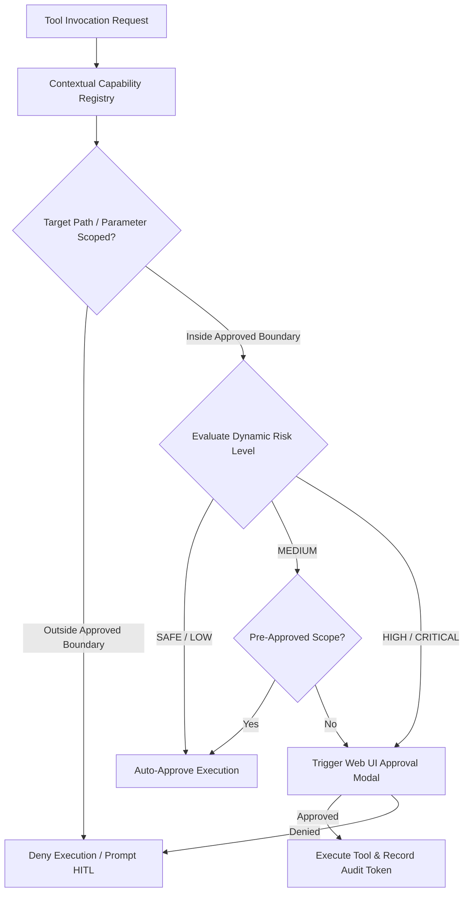

# JARVIS — Contextual Capability-Based Permission Model

## 1. Permission Architecture Overview

JARVIS implements a **Contextual Capability-Based Access Control (CCBAC)** framework. Permissions are not evaluated solely by static capability names; they are dynamically authorized based on **action context**, **target parameters**, **file paths**, and **recipient domains**.

---

## 2. Contextual Permission Evaluation Matrix

---

## 3. Capability Registry & Dynamic Parameter Boundaries

| Capability Code | Description | Parameter Boundary Rule | Risk Level | Approval Policy |
|---|---|---|---|---|
| `FILE_READ` | Reading local files | Allowed within `workspaceRoot` and authorized project dirs. | LOW | Auto-Approve |
| `FILE_WRITE` | Writing/modifying files | Allowed inside `workspaceRoot`. Blocked outside unless user overrides. | MEDIUM | Auto-Approve in Workspace; HITL outside |
| `FILE_DELETE` | Removing local files | Allowed inside workspace trash bin. | CRITICAL | **Always HITL** |
| `TERMINAL_EXECUTE` | Running CLI shell commands | Whitelisted binaries (`git`, `npm`, `node`, `python`, `cargo`). Blacklisted flags (`-enc`, `rm -rf /`). | HIGH | **Always HITL** |
| `BROWSER_CONTROL` | Navigating & scraping web pages | Unrestricted for HTTP/HTTPS public sites. Payment/login forms require confirmation. | LOW / MEDIUM | Auto-Approve for scraping; HITL for forms |
| `EMAIL_READ` | Reading email inbox | Configured user IMAP accounts. | LOW | Auto-Approve |
| `EMAIL_SEND` | Dispatching outbound emails | Pre-approved internal domains (`@company.com`). | HIGH | **Always HITL for new recipients** |
| `SYSTEM_CONTROL` | Launching apps & process control | App executable on whitelisted launcher list. | HIGH | HITL for non-whitelisted apps |

---

## 4. Capability Lifecycle & Audit Controls

1. **Granular Grant Scopes**:
   - **One-Time Grant**: Valid only for the specific correlation UUID of a task step.
   - **Session-Scoped Grant**: Valid for active session duration ($< 1\text{ hour}$).
   - **Persistent Workspace Grant**: Stored in database, scoped strictly to the current workspace root directory (`d:\Jarvis\workspace`).
2. **Audit Verification**:
   - Every permission evaluation generates an immutable audit record containing:
     `{ capability, toolName, parameters, decision: "GRANTED" | "DENIED", reason: "Workspace Scope Match" }`.
