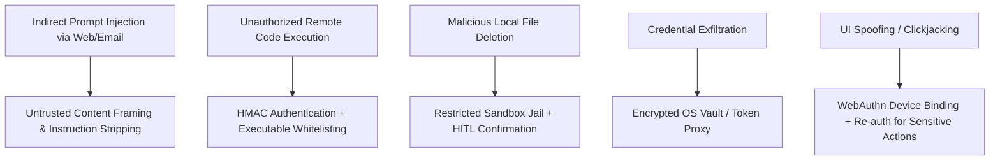

# JARVIS — Security Architecture & Threat Defense Specification

## 1. Security Architecture Core Principles

JARVIS operates with extensive access to personal data, local file systems, web accounts, and system APIs. Security is designed into the core system architecture rather than patched on top.

### Core Security Tenets
1. **Zero Trust Inside System Boundaries**: Every IPC message, WebSocket frame, and tool request must be authenticated, authorized, and validated.
2. **Least Privilege Enforcement**: Agents and tools operate with the bare minimum capability set required for their explicitly designated role.
3. **Defense in Depth**: Multiple security layers (Zod schema validation, capability checks, prompt injection wrapping, sandboxing, HITL approval) protect against single-point failures.
4. **Data Isolation**: Raw biometric credentials, master API keys, and un-sanitized external web content never leak to unauthorized components or client frontend code.

---

## 2. Threat Vector Analysis & Mitigation Matrix

| Threat Vector | Severity | Attack Surface | Mitigation Strategy |
|---|---|---|---|
| **Indirect Prompt Injection** | **CRITICAL** | Reading malicious web pages, emails, or PDFs designed to trick LLMs into running unauthorized tools. | Wrap external data in `<external_untrusted_content>` tags; strip instruction keywords; enforce strict prompt rules preventing tool invocations triggered solely by external text. |
| **Unauthorized Local RCE** | **CRITICAL** | Compromised web server or attacker sending arbitrary terminal commands to Local Desktop Agent. | Local Agent validates HMAC signature using local secret key; strict executable whitelist (no `powershell -enc`, no arbitrary string concat). |
| **Directory Traversal / Data Wiping** | **HIGH** | File management tool accessing system roots (`C:\Windows`) or deleting user files. | Canonical path checks restricting filesystem access to approved workspace root; file deletion requires mandatory HITL confirmation. |
| **Credential & API Key Theft** | **HIGH** | Exfiltrating API keys or OAuth refresh tokens via log leaks or frontend payloads. | Store keys in OS Vault / encrypted environment; proxy all outbound LLM/API requests server-side; strip secrets from client responses. |
| **Agent Infinite Loop / Resource Abuse** | **MEDIUM** | Agent stuck in infinite tool loop draining API credits or CPU. | Max 10 tool steps per task; 120s task timeout; consecutive identical call detection; user emergency stop button. |

---

## 3. Cryptographic Standards & Secrets Vault

1. **At-Rest Encryption**: Sensitive configuration files, paired agent secrets, and OAuth tokens are encrypted using **AES-256-GCM** with keys managed via Windows DPAPI / OS Keychain.
2. **In-Transit Encryption**: All network traffic requires **TLS 1.3** (`wss://` and `https://`).
3. **Secret Isolation Pattern**:
   - Master API keys (e.g. OpenAI, Anthropic, ElevenLabs) are loaded into server memory at boot.
   - Frontend UI receives temporary session JWTs with short expiry (15 minutes).
   - Frontend NEVER receives raw API keys or database connection strings.

---

## 4. Emergency Kill-Switch & Safeguards

JARVIS includes two independent emergency stop mechanisms:

1. **Hardware / Host OS Hotkey**: Pressing `Ctrl + Alt + Shift + K` on the host Windows machine instantly kills all child processes spawned by the Local Desktop Agent.
2. **UI Command Center Emergency Button**: Prominently displayed red button on the HUD top bar. Clicking it dispatches a high-priority system interrupt event that immediately cancels all active agent tasks, halts Playwright browser contexts, and closes active process handles.
