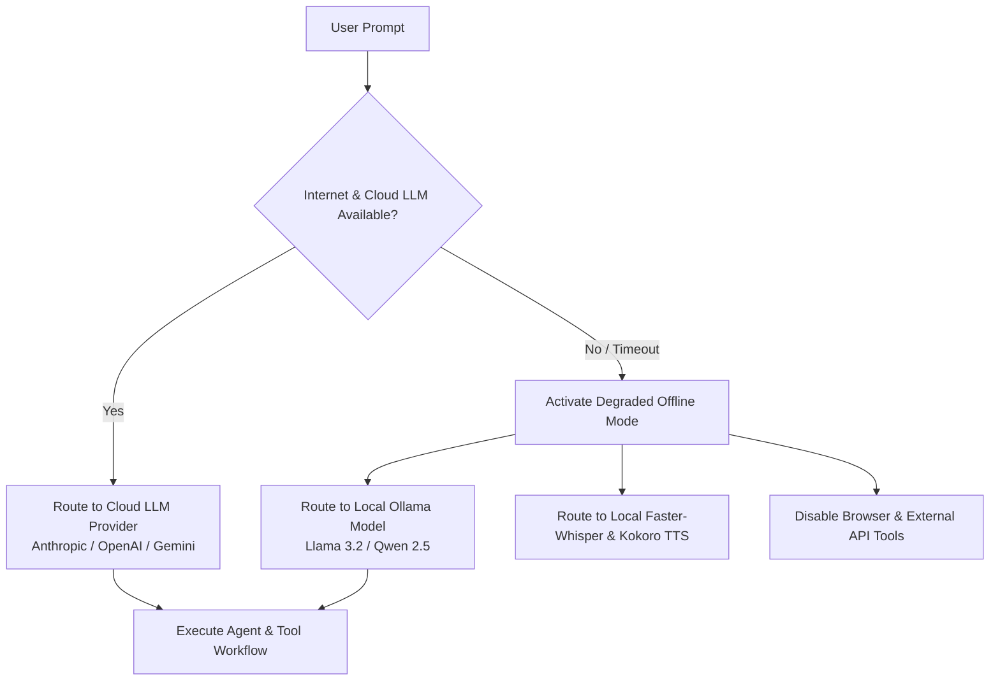

# JARVIS — System Design & Subsystem Integration

## 1. Executive Summary

This document specifies the end-to-end design of the JARVIS platform, explaining how data flows between the Web Frontend, Server Orchestrator, Local Desktop Agent, Browser Automation Subsystem, Multi-Agent Cognitive Pipeline, and LLM Provider Abstraction layer.

---

## 2. End-to-End System Sequence Diagram (with CoT Sanitization & HITL)

```mermaid
sequenceDiagram
    autonumber
    actor User
    participant WebUI as Web Command Center
    participant Server as Orchestrator / Server
    participant Provider as LLM Provider Abstraction
    participant Agent as Unified Agent Loop
    participant Tool as Tool Lifecycle Layer
    participant Local as Local Desktop Agent

    User->>WebUI: Voice or Text Prompt ("Summarize unread emails and launch VSCode")
    WebUI->>Server: Send Message Event (WS / REST)
    Server->>Provider: Request Intent & Plan Generation (Cloud / Local LLM)
    Provider-->>Server: Return Plan + Internal Reasoning
    Server->>Server: Sanitize CoT -> Extract High-Level Progress ("Planning task...")
    Server->>WebUI: Push Progress Event ("Analyzing request...")
    
    rect rgb(30, 40, 60)
        Note over Agent,Tool: Tool Execution 1: Email Summary (SAFE/LOW)
        Agent->>Tool: Execute `email_read_unread()`
        Tool->>Tool: Lifecycle: Schema Val -> Contextual Perm Check -> Exec -> Teardown
        Tool-->>Agent: Return Email List
        Server->>WebUI: Push Progress Event ("Emails retrieved, formatting summary...")
    end

    rect rgb(60, 30, 40)
        Note over Agent,Local: Tool Execution 2: Application Launch (HIGH Risk)
        Agent->>Tool: Execute `desktop_launch_app("code")`
        Tool->>Server: Evaluate Contextual Permission -> HITL Approval Required
        Server->>WebUI: Push HITL Approval Request Modal
        WebUI-->>User: Display Modal ("Allow JARVIS to open VSCode?")
        User-->>WebUI: Click "Approve"
        WebUI->>Server: Send Approval Grant Token
        Tool->>Local: Dispatch RPC payload over WSS (Encrypted HMAC)
        Local->>Local: Execute Win32 Process Launch
        Local-->>Tool: Return Process Success (PID: 10452)
        Tool->>Tool: Lifecycle Cleanup Hook
        Tool-->>Agent: Action Complete
    end

    Agent-->>Server: Final Response Payload
    Server->>WebUI: Stream Final Response & Telemetry HUD Update
    WebUI-->>User: Display HUD Update & Speak Voice Output
```

---

## 3. Data Subsystem Flows

### 3.1 Prompt & Telemetry Processing Flow
1. **User Request Channel**: User inputs prompt via Web UI text input, WebAudio microphone capture, or scheduled automation trigger.
2. **Context Assembly & LLM Call**: The orchestrator hydrates short-term history, user preferences, and system telemetry, then dispatches the prompt via the `LLMProviderAdapter`.
3. **CoT Sanitization Boundary**:
   - The LLM's raw chain-of-thought scratchpad is parsed server-side.
   - Raw model reasoning, system prompt rules, and untrusted injection strings are stripped.
   - Only user-friendly status tokens (e.g. `status: "Reading project directory..."`) are dispatched to the WebSocket stream.

### 3.2 Degraded Offline Sequence Flow

---

## 4. Reliability & Fault Tolerance Strategy

1. **Seamless Provider Fallback**: If primary Cloud LLM times out ($> 10\text{ s}$), the orchestrator retries using a secondary Cloud model, then drops to local Ollama.
2. **Strict Tool Resource Cleanup**: All tools execute within a lifecycle wrapper ensuring browser pages, subprocess handles, and temporary files are torn down even on failure.
3. **State Persistence**: Task state is persisted to SQLite/PostgreSQL after every sub-step completion, ensuring recovery across server restarts.
